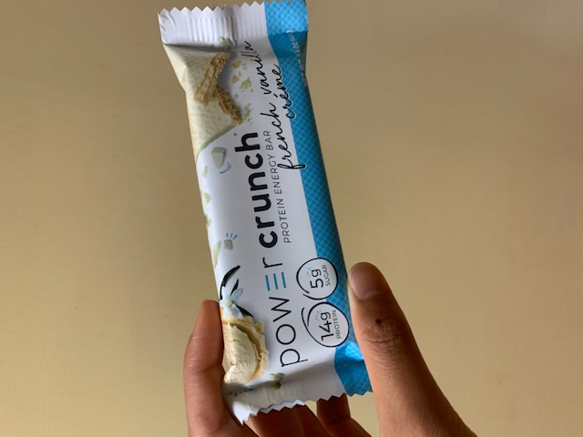

Rating & Review by: Rina  

This bar was quite unique. Unlike almost all other protein bars, this one did not feel like a solid glob of protein - or a glob of protein at all. The texture resembled that of an I-Mei wafer cookie and that in itself is just so unique and wonderful. The taste was pretty solid as well - not too sweet with a hint of saltiness. My only complaint is its extreme crumb-iness, as it makes consuming the bar while driving home from XC practice quite a feat.

# Ratings:

### Health: 9/10
### Taste: 8.5/10
### Texture: 9/10

## Overall rating: 9/10

